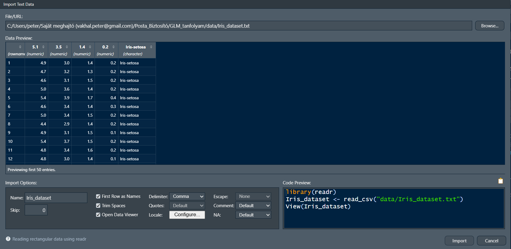

# Miről lesz szó a fejezetben?

A fejezetben megismertetjük az olvasót az $\texttt{R}$ programnyelv alapjaival valamint a legegyszerűbb adatkezelési technikáival. Fontos tudni, hogy az $\texttt{R}$ nem adatkezelő szoftver, hanem egy kifejezetten statisztikai elemzésre kifejlesztett, nyílt forráskódú, tudományos közösség által fenntartott programozási nyelv. Adatkezelési lehetőségei ezért erősen korlátozottak, és bár minden végrehajtható, gyakran egyszerűbb egy táblázatkezelő szoftverben (pl.: Microsoft Excel) megoldani bizonyos műveleteket. Látni fogjuk, hogy hatványozottan igaz ez az adattisztításra, mivel az $\texttt{R}$ nem rendelkezik beépített vizuális adatkezelő alkalmazással. A fejezet végén az Olvasó, kiegészítve az előadás során hallottakkal, képes lesz adatok betöltésére, azok manipulációjára, lekérdezések, kimutatások készítésére, valamint alapvető statisztikai becslések készítésére.

# Az $\texttt{R}$ programnyelv és az RStudio

## $\texttt{R}$ történelem

Az $\texttt{R}$ programnyelv a világ egyik legelterjedtebb programozás nyelve statisztikai elemzői, kutatói körökben. Mindez elsősorban annak köszönhető, hogy a nyílt forráskódot a tudományos közösség folyamatosan fejleszti, bővíti. A nyelv fókusza minden tudományterületre kiterjed a bölcsésztudományoktól kezdve, a természettudományokon át a társadalomtudományokig. A jelenleg szabadon elérhető modulok, csomagok ("*package*" - algoritmusokat, rutinokat tartalmazó függvények) száma több tízezer a "kínálat" pedig folyamatosan bővül, így minden diszciplína megtalálhatja a számára releváns függvényeket.

::: {.callout-note title="Kis R történelem"}
Az R programnyelv története az 1990-es évek elejére nyúlik vissza, amikor Ross Ihaka és Robert Gentleman az Aucklandi Egyetemen megalkották az S nyelv nyílt forráskódú dialektusaként. Az elmúlt évtizedekben az R a statisztikai modellezés, az adatelemzés és a tudományos igényű vizualizáció globális, de facto standardjává nőtte ki magát. Az iparban – különösen a gyógyszerkutatásban (biostatisztika), a pénzügyi kockázatelemzésben, a makrogazdasági modellezésben és az akadémiai szférában – betöltött szerepe megkerülhetetlen, amit elsősorban a reprodukálható kutatást támogató filozófiájának és a CRAN ökoszisztéma páratlanul gazdag csomagtárának köszönhet.

**Összehasonlítás más nyelvekkel**

Bár a modern adattudományi projektekben gyakran merül fel a nyelvválasztás kérdése, az R markánsan elkülönül alternatíváitól:

- **R vs. Python:** Míg a Python egy általános célú szoftverfejlesztő nyelv, amely kiválóan integrálható éles produkciós környezetekbe és dominál a mély tanulás (Deep Learning) területén, addig az R-t kifejezetten adatokkal dolgozó szakemberek tervezték adatokkal dolgozó szakembereknek. Az R „statisztikai gondolkodásmódja”, az adatkeretek natív kezelése és a *tidyverse* nyújtotta elegáns adatmanipuláció páratlan hatékonyságot biztosít a feltáró elemzések során.
- **R vs. Matlab:** A Matlab kiváló, robusztus mérnöki és mátrixalapú szimulációs keretrendszer, ám zárt forráskódú és magas licencköltségekkel jár. Ezzel szemben az R teljesen ingyenes, és nyílt közösségének köszönhetően a legújabb elméleti statisztikai és ökonometriai módszerek szinte azonnal elérhetővé válnak benne csomagok formájában.
- **R vs. C/C++:** A C-család tagjai rendkívül gyors, alacsony szintű nyelvek, amelyek optimálisak rendszerprogramozásra, de fejlesztési idejük és komplexitásuk miatt alkalmatlanok az adatok gyors, interaktív elemzésére. Ugyanakkor az R nem ellensége, hanem partnere ezeknek: a számításigényes háttérműveletek és a kritikus csomagok belső rutinjai mögött a háttérben ma is gyakran C, C++ vagy éppen Fortran kódok futnak az optimális teljesítmény érdekében.

*Forrás: Gemini*
:::

## RStudio - karmester az $\texttt{R}$-hez

Ahogy korábban már említettük az $\texttt{R}$ egy programozási nyelv, ezért az alapverzió semmilyen grafikus kezelőfelületet (*Graphical User Interface*) nem tartalmaz. A folyamatok jelentősen egyszerűsíthetők, ha a felhasználók az ingyenesen letölthető [RStudio](https://posit.co/downloads) használják, amely független a programnyelvtől, de számos olyan rövidítést, egyszerűsítést ("*shortcut*") tartalmaz, amely könnyen kezelhető környezetet biztosít a kódolás során. Az RStudio nem csupán az $\texttt{R}$-hez készített GUI, hanem magában integrál más programnyelveket is, mint például a Python, Julia, SQL, Stan stb, vagyis képes különböző nyelveken kódokat futtatni, az objektumok között pedig (feltételes) átjárhatóságot biztosít. Ezen kívül kezeli az úgynevezett *markdown* formátumot is, amely az elemzéseket reprodukálhatóvá teszi.

Léteznek más GUI applikációk is (pl.: [R Commander](https://github.com/RCmdr-Project/rcmdr)), amelyek még kezelhetebb felületet nyújtanak az $\texttt{R}$-hez, ugyanakkor ezek meglehetősen célzottak, vagyis csak bizonyos számú függvény futtatását teszik lehetővé (bár ezek kétségkívül a legnépszerűbbek), így nincs a lehetőségek meglehetősen leszűkítettek, használatukat csak akkor ajánljuk, ha a felhasználó meggyőződött róla, hogy a GUI-ban megtalálható függvények számára elegendők.

### Az RStudio felépítése

Az RStudio szabadon felülete szabadon alakítható, így most csak az alapverzióban megtalálható részleteket mutatjuk be, de arra biztatjuk az Olvasót, hogy a *Tools -\> Global Options* menüben szabadon fedezze fel a lehetőségeket.

**Environment**: itt találhatók az elmentett adatok, függvények és objektumok. Az objektum nevére kattintva beletekinthetünk az adatok szerkezetébe, azonban függvény hívására nincs lehetőség. Egy fontos dolog kiemelendő: a {fit-align="left" width="10%"} ikonra kattintva minden változót kitöröl a munkaterületről. **A műveletet nem lehet visszavonni.**

**Files**: az aktuális mappa, amiben dolgozunk. Nem feltétlenül szükséges használni, de egyszerűsíti a munkát, ha látjuk a fájlszerkezetet, illetve könnyen tudunk hivatkozni rá. Kattintásra a fájlok nem hivatkozhatók.

**Plots**: minden vizualizáció itt jelenik meg, menthető el, törölhető ki, illetve tárolható a memóriában.

**Packages**: az $\texttt{R}$ lelkét azok a csomagok adják, amiket a tudományos közösség fejlesztett. Itt a letöltött és telepített csomagokat láthatjuk. Újakat vagy a konzolból (lásd lentebb), vagy itt, az *Install* gombra kattintva telepíthetünk. A közösség világszerte működtet szervereket (Magyarországon az ELTE), amelyek a letölthető modulok folyamatosan tükrözött tárhelyei. Az itt megtalálható csomagok folyamatos fejlesztés alatt járnak, ellenőrzöttek. Előfordulhatnak olyan modulok is, amelyek nem találhatók meg a szerveren, ezeket külön tudjuk telepíteni. Az, hogy egy csomag nem található meg a szerveren nem feltétlenül jelenti azt, hogy nem megbízható, sokkal inkább csupán azt, hogy jelenleg nincs igazán "gazdája" (aki készítette nem kívánja karban tartani, aktualizálni stb.). Elsősorban a szerverről letöltött csomagok használatát javasoljuk.

**Help**: minden csomaghoz tartozik egy *help* kiegészítés is, ami kimerítően tartalmazza az összes függvény leírását, példával együtt.

**Console**: a konzol az RStudio és az $\texttt{R}$ kommunikácót biztosítja, lényegében itt tud a felhasználó az $\texttt{R}$-rel közvetlenül kommunkálni. Minden itt, valamint a fenti munkaterületen kiadott utasítást az $\texttt{R}$ a konzolban hatja végre és a válaszokat is elsősorban ott adja.

**Workspace**: ide írható, minden olyan utasítás, komment, szöveg, amit el szeretnénk magunknak tárolni, formázni stb.

## A workspace használata, kódok írása

Az elemzés elsősorban a munkaterületen zajlik, a konzolba utasításokat közvetlenül nem szokás írni. Nagyon fontos, hogy a munkaterületet elsősorban szöveg írására alkalmazzuk. Bármi, amit ide írunk szövegként lesz eltárolva, a csak úgy beírt kódok közvetlenül nem futtathatók, ehhez külön szükséges jelezni, hogy a következő szakaszban egy kód fog következni. {fit-align="left" width="10%"} gombra kattintva illeszthető be programkód a kiválasztott nyelven. Jellemzően minden nyelvhez elérhető fordító csomag, így nem kell több nyelven írni a jegyzetet, hanem elegendő csupán az $\texttt{R}$ alapú fordítót alkalmazni (SQL nyelv esetén tipikusan ez az eljárás).

Kódokat a jegyzetfüzetből a Windows operációs rendszerben a CTRL+ENTER kombináció segítségével tudjuk futtani soronként (több sor is kijelölhető), vagy a {fit-align="left" width="10%"} gombra kattintva tömbönként (a kijelölt helytől lefelé vagy fölfelé minden kódot futtasson).

Az $\texttt{R}$-ben minden, amivel dolgozunk, egy **objektum**. Statisztikai szempontból ez azt jelenti, hogy a modelljeink, az adataink és a függvényeink egyenrangúak a memóriában. Fontos megérteni a különbséget a *konzol* (ahol az utasítások azonnal végrehajtódnak) és a munkaterületi *script* (ahol a reprodukálható kutatás dokumentálható) között.

## Csomagok, package-ek telepítése, használata

Ahogy már fentebb említettük, az $\texttt{R}$ függvényeit a tudományos közösség tartja fenn. A megírt függvényeket csomagokban tölthetjük le valamelyik ún. CRAN szerverről. Fontos, hogy letöltés után be kell tölteni a csomagot, hogy használni tudjuk. Ha egyszer letöltöttünk egy csomagot, akkor később már nem szükséges újra letölteni, de minden alkalommal be kell tölteni.

A letöltés történhet konzolból, vagy GUI-ból. Mivel nincs nagy különbség a kettő között, ezért csak a konzolos változatot mutatjuk be. Telepítsük fel a $\texttt{dplyr}$ nevű csomagot, ami az adatmanipuláció széles körben alkalmazott modulja.

A szükséges függvények a következők:

```{r, eval=FALSE}
install.packages("dplyr") # fontos, hogy letöltéskor mindig idézőjelbe kell tenni a csomag nevét, hiszen ekkor még nem objektumként van tárolva
library(dplyr) # betöltéskor ugyanakkor már nem szükséges az idézőjel, hiszen a csomag már objektumként létezik a rendszerünkben
```

Jellemzően szoktunk kapni valamilyen kommunikációt a sikeres letöltésről, telepítésről és betöltésről, bizonyos esetben akár figyelemfelhívást is.

::: {.callout-warning title="Warning! figyelmeztetés"}
Csomagok betöltésekor, valamint függvények futtatásakor sok esetben kaphatunk **Warning!** üzenetet. Ezek legtöbbször nem jelentik azt, hogy a művelet ne futott le volna sikeresen, ne lenne érvényes az eredmény, de felhívja a figyelmet, hogy valamilyen feltétel sérült, nem teljesült, vagy esetleg figyelmeztet minket, hogy milyen feltételek mellett érvényesek az eredmények. Olvassuk el, és döntsük el, hogy a figyelmeztetés hogyan érinti a mi munkánkat.
:::

::: {.callout-important title="Tűzfalak"}
Ahhoz, hogy az $\texttt{R}$ le tudja tölteni a csomagokat, ki kell lépnie a tűzfalon kívülre. Ezeket a legtöbb vállalati rendszer tiltani szokta, ezért fontos, hogy az IT támogatólag lépjen fel, és adja hozzá kivételként a szoftvert. A CRAN szerver szigorúan ellenőrzött, egy csomagot akár több millióan is letölthetnek, így a víruskockázat szinte nem létezik.

Ha nagyon gyorsan szükséges egy csomag, akkor azok minden esetben elérhető .zip fájlként (ilyenkor egy Google keresés vezet el a helyes CRAN vagy github oldalra). Ha ezt a fájlt le lehet tölteni valamilyen módon, akkor ezután közvetlenül telepíthető a Tools -\> Install Packages menüből, ahol az "Install from" lenyíló menüből kiválasztjuk a .zip opciót.

Sok esetben azonban ez sem járható út, többek között azért, mert egy csomag a legtöbb esetben más csomagok függvényeire is támaszkodik, amit egy $\texttt{install.packages()}$ függvény automatikusan letölt. Ha csak annak a csomagnak a .zip fájlját töltjük le, amit használni szeretnénk, akkor elképzelhető, hogy még sok másik csomagot le kellene töltenünk, ami szinte kivitelezhetetlen.

Ilyenkor két alternatíva jön szóba, amíg az IT segít:

- Google Colab, ami egy alapvetően ingyenes felhőalapú programozási felület és képes $\texttt{R}$ kódokat is futtatni, csomagokat telepíteni. Mivel ez a Google szerverén fut, ezért semmilyen engedély nem szükséges a csomagot telepítéséhez.
- RStudio Server, amit a Posit tart fenn, és egy felhőalapú alapvetően szintén ingyenes szolgáltatás.

Mindkét megoldás alapverziója ingyenes, ám rendkívül lassú, és mivel adatainkat ilyenkor egy külső szerverre helyezzük, ezért komoly adatvédelemi aggályok is felmerülnek. Mivel azonban nem vesz el számítókapacitás a saját helyi gépünktől, ezért gyakran kényelmes megoldást jelentenek.
:::

## Mesterséges intelligencia és az $\texttt{R}$

A jelenleg használatos népszerű nagy nyelvi modellek mind ismerik az $\texttt{R}$ kódnyelvet és kiváló válaszokat tudnak adni a kérdésekre. Bármelyik NLP használata erősen javallt, különösen akkor, ha hosszú, repetitív elemeket tartalmazó kódot kell írnunk. Jó magyarázatokat kaphatunk és a hibákat is jellemzően jól ismerik fel, de természetesen teljesen ne bízzuk rá magunkat, különösen egy olyan területen, amit kevésbé ismerünk.

# $\texttt{R}$ alapok

Az adatok beolvasása előtt tekintsük át a legfontosabb parancsokat, adatstruktúrákat, függvényeket.

## Műveletek változókkal

### Változó definiálása

A változók definiálása elsősorban a (\<-) operátorral történik, de bizonyos esetekben alkalmazható a (=) operátor is. Ez utóbbit nem javasoljuk, mert kavarodást okozhat a logikai (==) azonosságot jelentő operátorral.

```{r}
x<-1 # tároljuk el az értéket
print(x) # irassuk ki az értéket
x # a kiíratás így is működik

y<-7

z<-sqrt(x+y) # hivatkozzunk egy változókra a függvényben
z
```

Láthattuk, hogy skalárt operátor nélkül tudunk definiálni, vektor rögzítéséhez azonban a c() operátor alkalmazása szükséges. Mindenképpen meg kell jegyeznünk, hogy technikai értelemben az $\texttt{R}$ nem ismeri a skalárt, hanem egy egyelemű vektorként kezeli. Ennek értelmében a helyes definiálás az x\<-c(1) lett volna, de egy elem esetén a c() operátor nélkül is elfogadott.

Egy vektorban számokat és szöveget is tudunk tárolni, akár vegyesen is, de ez utóbbi esetben szöveg (string) típusként azonosítjuk a változókat. Szöveg esetén nagyon fontos, hogy a szöveg idézőjelek közé teendő. Ha nem így teszünk, akkor a beírt szöveg hivatkozásként lesz értelmezve a változókészletből.

```{r}
x<-c(1, 2, 3.467, 4.01)
y<-c("cat", "dog")
z<-c(1, "cat", TRUE)
```

Érdemes még megemlíteni a szekvenciák ($\texttt{seq()}$, illetve rövidebben $\texttt{from:to}$) és az ismétlés függvényeket ($\texttt{rep()}$).

```{r}
x_grid <- 1:10             # Egész számok 1-től 10-ig [10 elem].
p_grid <- seq(from=0, to=1, by=0.05) # Valószínűségi rács.
groups <- rep(c("A", "B"), times=5) # Ismétlődő minták generálása [10 elem].
```

### Indexálás

A Python programozási nyelvhez képest az egyik legnagyobb különbség a vektorok indexálása. Az $\texttt{R}$-ben egy vektor első elemének az indexe **1**. Ezzel szemben a Python-ban az első elem indexe a 0. A nulladik indexet az $\texttt{R}$ nem ismeri. Egy vektor elemére vagy elemeire való hivatkozás a $\texttt{változó[]}$ módon történik.

```{r}
x[4] # a vektor második eleme
x[1:3] # a vektor első három eleme
```

::: {.callout-important title="Változó tárolása"}
Amennyiben nem mentjük el a változót az \<- operátorral, úgy az $\texttt{R}$ csupán végrehajtja a parancsot, de **nem írja felül a változót**. Ügyeljünk rá, hogy felülírás esetén (például x\<-x\[1:3\]) az $\texttt{R}$ nem kér megerősítést.
:::

Egy kellemes funkció, hogy a negatív indexálás az elem elhagyását jelenti a vektorból.

```{r}
x[-1] # az első elem elhagyása a vektorból
x[-c(1,3)] # az első és a harmadik elem elhagyása a vektorból
x[-c(1:3)] # az első három elem elhagyása a vektorból
p_grid[-seq(from=2, to=21, by=2)] # minden második elem elhagyása a vektorból
```

Az indexálás nagy előnye, hogy logikai operátorokat (\<==\>) is kezel.

```{r}
x[x>3] # 3-nál nagyobb értékű elemek
```

::: {.callout-important title="Logikai operátorok"}
$\texttt{R}$-ben az azonosságot nem "=" jellel, hanem dupla "==" jellel jelöljük. A negáció pedig "!=" operátottal jelölendő. A logikai ÉS a "&" operátorral, míg a VAGY a "\|" (magyar billentyűzeten ALTGR+W) operátorral használatos. Minden esetben a vonatkozó változót az "&" és a "\|" operátorok mindkét oldalán definálni kell.
:::

```{r}
groups[groups=="A"] # csak "A" karakterek a vektorban
p_grid[p_grid<=0.2 | p_grid>=0.8] # 0.2-nél kisebb vagy egyenlő VAGY 0.8-nál nagyobb vagy egyenlő elemek
p_grid[p_grid<0.2 & p_grid>0.8] # az eredmény egy üres vektor, mert nincs olyan szám, ami kisebb, mint 0.2 ÉS nagyobb, mint 0.8.
```

### Vektorizáció

Az $\texttt{R}$-ben a vektorokkal végzett aritmetikai műveletek az elemek mentén hajtódnak végre. A "\*" operátorral végzett szorzat tehát nem skaláris. Fontos, hogy csak azonos hosszúságú vektorokon végezhetők el a műveletek.

```{r}
x <- c(1, 2, 3)
y <- c(10, 20, 30)
x * y # nem skaláris szorzat
```

A skaláris szorzat elvégzéséhez a $\texttt$ operátor használata szükséges.

```{r}
x%*%y # skaláris szorzat
```

::: {.callout-important title="Újrafelhasználási szabály"}
Rendkívül fontos felhívni a figyelmet, hogy az $\texttt{R}$ képes eltérő hosszúságú vektorokon is műveletek végrehajtani. Ilyenkor a rövidebb vektort ciklikusan ismétli (újrafelhasználja), amíg el nem éri a hosszabb vektor méretét. Ez a tulajdonság rendkívül hasznos például expozícióval való súlyozáskor, de veszélyes hibaforrás is lehet, ha a hosszak nem egymás többszörösei.
:::

## Hiányzó adatok és kezelésük

$\texttt{R}$-ben a hiányzó adatokat az $\texttt{NA}$ operátor jelöli. Ha egy vektor hiányzó elemet tartalmaz, akkor az elemmel végrehajtott művelet automatikusan $\texttt{NA}$ értéket fog kapni. Amennyiben skaláris műveletet hajtunk végre hiányzó elem mellett, akkor az eredmény vagy $\texttt{NA}$ érték lesz, vagy hibaüzenet. Ez az $\texttt{R}$ egy kellemes tulajdonsága, hogy minden esetben felhívja a figyelmet arra, hogy vannak hiányzó adatok.

```{r}
x<-c(10, 20, NA, 30, 40)
y<-c(5, 15, 25, 35, 45)
x+y
x*y
x/y
x%*%y
```

## Alapstatisztikák

Az $\texttt{R}$ igazi ereje a statisztikai számítások esetén mutatkozik meg. A leggyakrabban használt statisztikai függvények megtalálhatók az alapverzióban, nem szükséges semmilyen csomag telepítése, betöltése. Többet között ilyen a $\texttt{mean}$, $\texttt{sd}$ vagy a $\texttt{summary}$ függvények is. Az $\texttt{R}$ alapverziójában megtalálható függvények száma ezer feletti. Néhány példát áttekintünk, amelyek a leíró statisztikához szükségesek.

```{r}
x<-rnorm(1000, mean = 0, sd = 1) # egy standard normális eloszlású 1000 elemű véletlen vektor generálása 
```

::: {.callout-tip title="Alapértelmezett értékek"}
A legtöbb függvény különböző hiperparaméterek mellett definiálható. A legtöbb paraméternek van alapértelmezett értéke vagy függvénye, így ha az számunkra megfelelő, akkor nem kell külön definiálni. Az $\texttt{rnorm}$ függvény például három paraméter mellett definálható: az elemszám ($\texttt{n}$) az átlag ($\texttt{mean}$) és a szórás ($\texttt{sd}$), a függvénye pedig $\texttt{rnorm(n, mean, sd)}$. Ezek az alapértelmezett értékek $\mu=0$ és $\sigma=1$ (a standard normális eloszlás értékei), így ha ezek megfelelnek számunkra, akkor csupán az elemszámot kell megadni, vagyis futtatható az $\texttt{rnorm(n)}$ függvény a paraméterek nélkül. Ha el kívánunk térni az alapértelmezett paraméterektől, akkor a módosított értéket definiálni szükséges.

Az alapértelmezett értékekről mindig információt nyújt a függvény *help* melléklete, amit a $\texttt{?függvény}$ paranccsal kérhetünk le.
:::

Most végezzünk el néhány alapvető statisztikai becslést az előbb definiált vektorral.

```{r}
mean(x) # várható érték
sd(x) # szórás
summary(x) # leíró statisztika
```

::: {.callout-important title="Véletlen változók"}
Ideális esetben a véletlen változó valóban véletlen módon generálódik a processzor órajele alapján. Egy szerverre kötött gépek esetén a véletlen szám a szerver processzorának órajele alapján generálódik, így a szerver minden gépen várhatóan azonos lesz.

Fontos azonban, hogy minden futtatás új véletlen számot generál. Ha meg kívánjuk őrizni a véletlen számot és más gépeken is szeretnénk ugyanazt kapni, úgy a $\texttt{set.seed()}$ paranccsal és egy megadott számmal ez megvalósítható. [Douglas Adams](https://en.wikipedia.org/wiki/Phrases_from_The_Hitchhiker%27s_Guide_to_the_Galaxy#The_Answer_to_the_Ultimate_Question_of_Life,_the_Universe,_and_Everything_is_42) után szabad a közösség gyakran a $\texttt{set.seed(42)}$ formátumot szokta alkalmazni.
:::

## Faktorok

A biztosításmatematikai modellekben a prediktorok jelentős része kategória típusú (pl. régió, bónusz-malusz osztály). $\texttt{R}$-ben ezeket faktorként kezeljük, ami belsőleg egész számokból és a hozzájuk tartozó szintekből (levels) áll. Fontos megjegyezni, hogy a legtöbb modellben a faktorok automatikusan dummy változókká alakulnak a modellmátrix felépítésekor.

```{r}
regiok <- c("Pest", "Vidéki város", "Pest", "Község", "Vidéki város")
regio_faktor <- factor(regiok) # az R automatikusan ábécé sorrendbe teszi a szinteket

# Gyakran szükség van egy bázisszint (referencia) rögzítésére a modellezéshez.

# ezt a levels argumentummal kontrollálhatjuk
regio_faktor <- factor(regiok, levels = c("Pest", "Vidéki város", "Község"))

# Ellenőrizzük a szinteket - a modellezésnél az első lesz a bázisszint.
levels(regio_faktor)
```

## Adattáblák (data frames)

Az adattábla az $\texttt{R}$ legfontosabb objektumtípusa. Egy lista, ahol minden elem azonos hosszúságú. Megfelel egy SQL táblának vagy Excel munkalapnak, de az oszlopok szigorúan típusosak. Nem keverendő a mátrix formátummal, ami kizárólag azonos típusú adatot tud tárolni. A legtöbb esetben az adatimportálás során eleve adattáblába történik a beolvasás. Könnyen, változónévvel vagy indexszel is hivatkozható tömbökről van szó.

Ha mi magunk hozzuk létre a táblát, akkor külön definiálandó minden oszlop (változó).

```{r}
df <- data.frame(
  id = 1:5,
  kor = c(25, 45, 30, 55, 40),
  kar_esemeny = c(FALSE, TRUE, FALSE, FALSE, TRUE)
)
```

::: {.callout-important title="Logikai értékek definálása"}
Az igaz-hamis értékek eleve faktorváltozóként kerülnek tárolásra. Nagyon fontos a definiálás során, hogy **mindig nagybetűvel** kell őket írni, vagy is **TRUE** vagy **FALSE**.
:::

A data frame objektum már kellemes módon, külön ablakban jeleníthető meg, ha az *environment* ablakban az objektum nevére kattintunk.

Az adattáblák legnagyobb előnye, hogy könnyen hivatkozhatók az $\texttt{\$}$ operátorral a változó neve után írva.

```{r}
df$kor
```

Természetesen indexálással is működik, mivel azonban már nem vektorral, hanem táblával dolgozunk, ezért két indexet kell megadnunk, egy sort és egy oszlopot, ebben a sorrendben. Generikusan $\texttt{variable[,]}$ módon írhatjuk fel a hivatkozást. Ha mindkét paramétert megadjuk, akkor értelemszerűen egy elemre, a metszéspontra hivatkozunk.

```{r}
df[1,2] # első sor, második oszlop metszete, azaz az első elem

# Ha elhagyjuk valamelyik paramétert, akkor a teljes sorra/oszlopra hivatkozunk
df[,3] # minden elem (minden sor) a harmadik oszlopból
df[3,] # harmadik megfigyelés (harmadik sor) minden eleme (minden oszlopa)

df[2:4,] # másodiktól a negyedik sorig minden oszlop
df[2:4,1:2] # a másodiktól a negyedik sorig, az első két oszlop
```

Természetesen működik a kettő kombinációja is, de csak akkor ha egy változót indexálunk. Ilyenkor már nem adattáblánk, hanem vektorunk lesz (hiszen csak egy változóra hivatkozunk a táblából).

```{r}
df$kor[2:3] # a kor változó második és harmadik eleme
```

# Adatok importálása és adatmanipuláció

## Adatok importálása

Az $\texttt{R}$ a legtöbb adattípust tudja be tudja olvasni. Azonban saját adattípussal rendelkezik **.RData** formátumban, amennyiben $\texttt{R}$-ben dolgozunk úgy, érdemes ezt a típust alkalmazni a saját fájlok esetén és nem visszakonvertálni egy másik formátumra.

Beépített adatimportáló funkciók léteznek, ezeket érdemes használni. Mindazonáltal érdemes az adattisztítást előre elvégezni egy nagyobb rugalmasságot engedő GUI-val rendelkező szoftverben (pl: Excel), ha az úgy gyorsabb.

A betöltés a File -\> Import Dataset -\> From Text párbeszéd ablakon keresztül történik. Mind a "base", mint a "readr" megoldás alkalmazható, ez utóbbi talán kényelmesebb.



A párbeszédablak magától értetődő. A beolvasás során a csomag megpróbálja felismerni az adattípust, amennyiben nem jól tette, úgy változtathatunk a változó nevére kattintva. Ügyeljünk rá, hogy gyakran előfordul, hogy külön oszlopot hoz létre a megfigyelés sorszámának. Amennyiben erre nincs szükségünk, úgy ugorjuk át ezt az oszlopot, azaz állítsuk *skip* értékre. A jobb alsó sarokban láthatjuk a generált kódot, amit akár ki is másolhatunk, de az import gombra kattintva is végrehajtódik a függvény.

```{r}
library(readr) # töltsük be a csomagot (előre van telepítve)
iris <- read_csv("data/Iris_dataset.txt") # olvassuk be az adatokat
```

Ugyanezen az elvan működik az .xlsx (File -> Import Dataset -> From Excel)  vagy a .csv (itt ugyanúgy a fentebb ismertetett From Text menüpontra van szükség) fájlok betöltése.

## Adatmanipuláció a $\texttt{dplyr}$ csomag segítségével

A $\texttt{dplyr}$ csomag a legszélesebb körben alkalmazott adatmanipulációs csomag, amelynek szinte végtelen kombinációs lehetőségei vannak. Most a leggyakoribb műveleteket tekintjük át, de arra ösztönözzük az Olvasót, hogy szükség esetén konzultájon valamelyik NLP alapú ügynökkel, hogy bonyolult manipulációkat is végre tudjon hajtani.

A $\texttt{dplyr}$ csomag egyik legnagyszerűbb eleme a *pipline* operátor, amivel objektumokat tudunk összekapcsolni. Az $\texttt{R}$ ugyanis alapesetben csak a függvényen belül tudja kezelni az objektumokat, ez sokszor kényelmetlen, ha egymásba szeretnék ágyazni több függvényt is. A *pipline* operátor a $\texttt$ módon definálható.

**Nagyon fontos, hogy a $\texttt{dplyr}$ csomag csak a data frame alapú objektumokat tudja kezelni!**

### $\texttt{select()}$

Ez a művelet a változók (oszlopok) egy részhalmazának kiválasztását végzi el. A változók nevét nem kell idézőjelbe tenni.

```{r}
library(dplyr) # töltsük be a csomagot

select(iris, Sepal.Length, Sepal.Width) # a szirom hosszúság és szélesség kiválasztása

# Ugyanez %>% operátorral
iris %>%
  select(Sepal.Length, Sepal.Width)

select(iris, -Species, -Petal.Length) # változók kihagyása

select(iris, contains("Petal")) # a "Petal" karakterláncot tartalmazó változónevek kiválasztása
```

A $\texttt{contains()}$ függvény helyett értelemszerűen alkalmazhatók a 'starts_with', 'ends_with'  és a $\texttt{matches()}$ függvények is.

### $\texttt{filter()}$

Megfigyelések (sorok) kiválasztásához egy adott kritérium alapján használjuk a $\texttt{filter()}$ függvényt.

```{r}
filter(iris, Species == "setosa") # csak a "setosa" fajta kiválasztás

# Ugyanez %>% operátorral
iris %>%
  filter(Species=="setosa")

filter(iris, Species == "setosa" | Species == "virginica") # "setosa" vagy "virginica" típusok kiválasztása

filter(iris, Species == "setosa" & Sepal.Length < 5) # 5mm-nél kisebb szirmú "setosa" típus kiválasztása (ÉS)
```

Több függvényt a $\texttt$ könnyen egymásba ágyazhatunk.

```{r}
iris %>% 
    filter(Sepal.Length < 5) %>% # 5mm-nél kisebb szirom
    select(Sepal.Width, Sepal.Length, Species) %>% # csak ezek a változók
    head(4) # csak az első négy megfigyelés kiíratása
```

### $\texttt{mutate()}$

A $\texttt{mutate()}$ függvénnyel új változót adhatunk az adattáblánkhoz. Ez gyakran elő fog fordulni adatmanipuláció során, mert sok esetben segédváltozóra van szükség egy-egy bonyolultabb kimutatás előállításához. Ellátsuk elő például az értékek arányait.

```{r}
iris %>% 
    mutate(Petal.Shape = Petal.Width / Petal.Length,
           Sepal.Shape = Sepal.Width / Sepal.Length) %>% 
    select(Species, Petal.Shape, Sepal.Shape)
```

### group_by és $\texttt{summarize}$
Számos adatelemzési feladat megközelíthető a split-apply-combine paradigma segítségével:

* bontsuk fel az adatokat csoportokra,
* alkalmazzunk valamilyen elemzést mindegyik csoportra,
* Kombináljuk az eredményeket.

A $\texttt{dplyr}$ ezt nagyon egyszerűvé teszi a group_by és $\texttt{summarize}$ függvények használatával. A group_by minden csoportot egyetlen soros összefoglalóvá csuk össze. Argumentumként azokat az oszlopneveket veszi, amelyek azokat a **kategorikus (faktor)** változókat tartalmazzák, amelyekre az összefoglaló statisztikákat ki szeretnénk számítani. 

```{r}
iris %>% 
    group_by(Species) %>% 
    summarise(Mean.Petal.Length = mean(Petal.Length)) # átlagos hossz kiszámítása fajonként
```

Több összefoglaló statisztikát is számíthatunk.

```{r}
iris %>% 
    mutate(Petal.Long = Petal.Length > 5) %>% # új változó, ami logikai érték (egy "=" jel), eldönti, hogy az állítás igaz-e, vagy hamis
    group_by(Species, Petal.Long) %>% # fajok és az előbb létrehozott logikai változó alapján csoportosítunk
    summarise(Mean.Petal.Length = mean(Petal.Length), # csoportátlag
              n.Petals = length(Petal.Length), # elemszám
              sd.Petal.Length = sd(Petal.Length), # szőrás
              SE.Petal.Length = sd(Petal.Length) / sqrt(length(Petal.Length))) # relatív hiba
```


### $\texttt{arrange()}$

Gyakran előfordul, hogy a sorokat rendezni szeretnénk csökkenő vagy növekvő sorrendben. A $\texttt{dplyr}$ segítségével ez elegánsan elvégezhető, de természetesen alkalmazható a $\texttt{sort()}$ függvény is, ami az alapcsomag része.

```{r}
iris %>% 
    group_by(Species) %>% 
    summarise(Mean.Petal.Length = mean(Petal.Length),
              n.Petals = length(Petal.Length),
              sd.Petal.Length = sd(Petal.Length),
              SE.Petal.Length = sd(Petal.Length) / sqrt(length(Petal.Length))) %>% 
    arrange(-Mean.Petal.Length) # csökkenő sorrend a negatív jel miatt
```

### $\texttt{xtabs()}$, $\texttt{table()}$ és egyéb kereszttáblás megoldások
A kereszttábla készítés meglehetősen bonyolult művelet minden szoftverben, különösen, ha előtte még szükség van valamilyen adatmanipulációra. Egy kereszttáblában jellemzően két faktorváltozó metszetében a gyakoriság jelenik meg. Amennyiben megvan a két faktorváltozónk úgy nem bonyolult a dolog, ha nincs, akkor elő kell állítani.

Az $\texttt{xtabs()}$ és $\texttt{table()}$ két előre beépített függvény, amelyek azért jók, mert későbbiekben a statisztikai függvényeket ezeket jellemzően el szokták fogadni inputként. Fontos azonban, hogy ez a kettő elemi függvény, ezért $\texttt$ operátorral nem mindig tudnak kapcsolódni. Legtöbbször csupán a $\texttt{data=.}$ paraméterrel jelezni kell, hogy korábban már megadtuk az adatok forrását. 

```{r}
iris %>%
  mutate(Petal.Long = Petal.Length > 5) %>%
  xtabs(~ Species + Petal.Long, data=.)
```

A $\texttt{table()}$ az egyik legelemibb belső függvény, sajnos gyakran gyorsabban eredményhez jutunk, ha külön változóként elmentjük a módosított adattáblát, majd erre hivatkozva kérjük le a kereszttáblát.

```{r}
iris2 <- iris %>%
  mutate(Petal.Long = Petal.Length > 5)

table(iris2$Species, iris2$Petal.Long)
```

